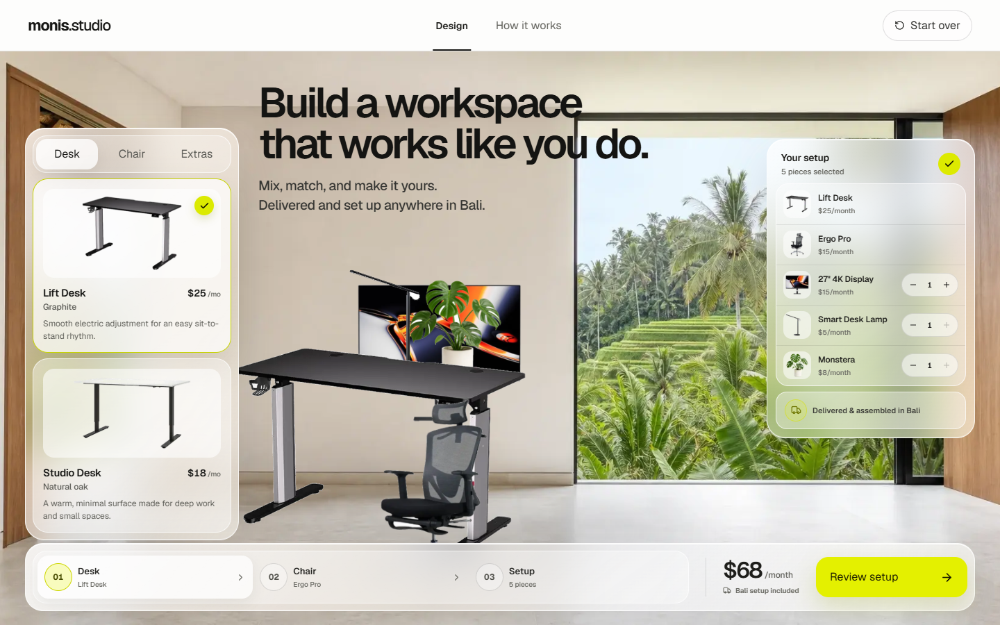

# monis.studio — Workspace Designer

A visual office-rental configurator for digital nomads and startup teams in Bali. Build a complete workspace by switching desks and chairs, adding accessories directly into the room, and reviewing a live rental summary before checkout.

**[Open the live experience](https://desent-test-xi.vercel.app)** · **[View the repository](https://github.com/Morr3r/monis-workspace-studio)**



## Approach

The experience is designed around one idea: choosing rental furniture should feel like creating a space, not filling in a form. A bright Bali room acts as the canvas, each product is composited into that scene as the selection changes, and the price and setup summary remain visible without interrupting the design flow. The interface uses a restrained iOS-inspired liquid-glass system, warm natural imagery, editorial typography, and a single lime action color to keep the result premium but easy to scan.

The checkout is intentionally lightweight. Users can compare monthly and weekly plans, adjust accessory quantities, choose an area and delivery date, then complete the prototype flow with clear loading and success feedback.

## Highlights

- Two selectable desks and two selectable chairs
- Live layered workspace preview
- Add, remove, and quantity-control monitors, lighting, and plants
- Monthly/weekly pricing and accurate piece totals
- Responsive desktop, tablet, and mobile layouts
- Accessible tabs, focus states, live announcements, Escape-to-close, and reduced-motion support
- Itemized checkout with delivery details and confirmation state

## Tech choices

- **Next.js 16 App Router** and **React 19** for the application shell and interactive client state
- **Tailwind CSS 4** plus a small custom CSS layer for responsive composition, glass materials, and motion
- **TypeScript** for the product model and UI state
- **Lucide React** for consistent interface iconography
- **Vercel** for production deployment

No external state library is needed for this MVP; the configurator state is local, predictable, and small enough to keep close to the UI.

## Run locally

```bash
npm install
npm run dev
```

Open [http://localhost:3000](http://localhost:3000).

Production checks:

```bash
npm run lint
npm run build
npm audit --omit=dev
```

## Project structure

```text
src/
  app/                         App shell, metadata, and global visual system
  components/workspace-studio Product data, catalog, preview, checkout, state
public/products/               Optimized room and transparent product assets
docs/design/                   Concept, implementation captures, fidelity notes
design-system/                 Persisted UI/UX direction and design tokens
```

## Asset notes

Desk, ergonomic chair, monitor, and lamp references are based on product photography from [monis.rent](https://monis.rent/). The empty Bali room, soft task chair, plant, and visual direction concepts were generated specifically for this prototype, then optimized and isolated for real-time compositing.

## With more time

I would connect the final CTA to Monis inventory and availability, persist shareable configurations in a database, add drag-to-position controls with collision-aware placement, and support multiple room templates. I would also add automated visual-regression tests across breakpoints and replace prototype delivery pricing with live service-area rules.

## Design documentation

- [Visual fidelity ledger](docs/design/fidelity-ledger.md)
- [Configurator concept](docs/design/workspace-configurator-concept.png)
- [Checkout concept](docs/design/workspace-checkout-concept.png)
